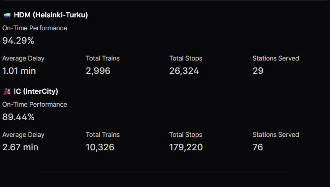
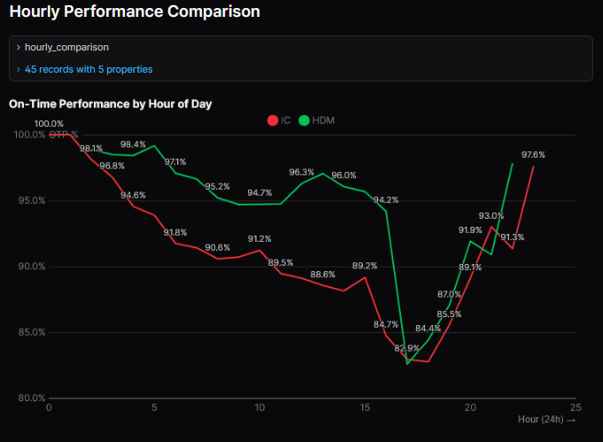
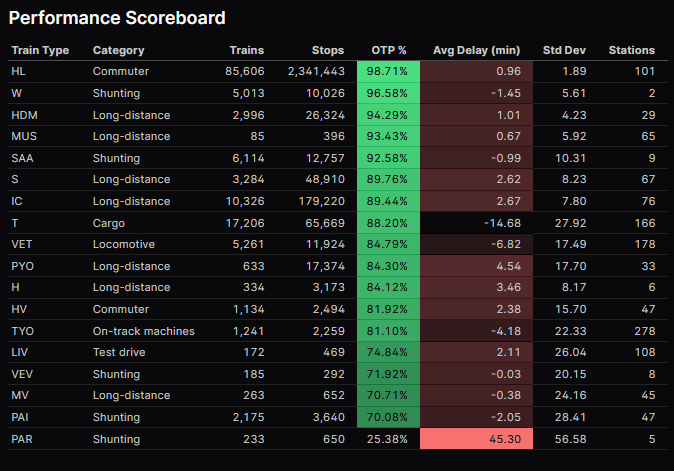
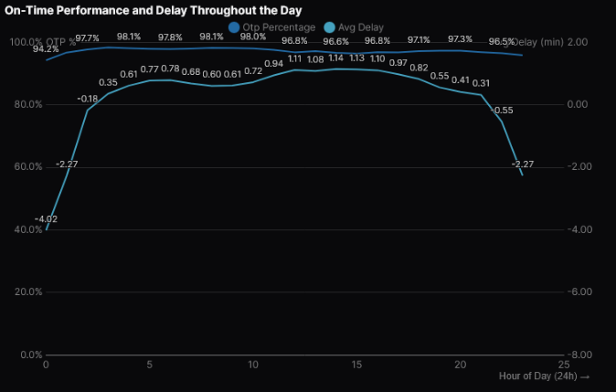

# Fintraffic Railway data platform

This repository contains a data platform setup for analyzing Finnish Railway data. It uses **uv** for Python management, **dbt** for data transformation, and **Evidence** for BI dashboards.

Business goal was to analyze On-Time Performance (OTP) and delays of VR trains in Finland. The analysis investigates time-based patterns, train type comparisons, and station-level metrics to identify performance trends.

## Dashboard Previews

IC vs HDM train type performance comparison:

<p align="center">
  
  
</p>

Train type and delay pattern analysis:

<p align="center">
  
  
</p>

## Prerequisites

*   **Python 3.12+**
*   **uv** (Python package manager)
    *   Install: `pip install uv` or see [uv docs](https://github.com/astral-sh/uv)
*   **Docker** (for Evidence)

---

## 1. Environment Setup (uv)

Initialize the environment and install dependencies.

```bash
uv sync
```
*(Creates `.venv` and installs packages from `uv.lock`)*

Please, run commands inside the virtual environment using `uv run <command>`.

---

## 2. Ingestion (Fetch Data)

Download railway data (Digitraffic API) into the staging area.

*   **Quick Start (Menu):**
    *   **Windows:** `.\fetch_data.bat`
    *   **Mac/Linux:** `./fetch_data.sh`

*   **Manual Command:**
    ```bash
    uv run python src/data_ingestion.py --start 2024-11-01 --end 2024-12-01
    ```

---

## 3. Transformation (dbt)

Process raw data into structured tables (Bronze -> Silver -> Gold).

1.  **Navigate to dbt directory:**
    ```bash
    cd dbt_warehouse
    ```

2.  **Install dbt dependencies:**
    ```bash
    uv run dbt deps
    ```

3.  **Build & Test Models:**
    ```bash
    uv run dbt build
    ```

### Useful dbt Commands
*   **Generate & View Documentation:**
    ```bash
    uv run dbt docs generate
    uv run dbt docs serve
    ```
*   **Inspect Database (DuckDB CLI):**
    ```bash
    # Open the database in an interactive UI-like mode
    uv run duckdb -ui data/warehouse/warehouse.duckdb
    ```
    *(Note: Path may vary depending on where your .duckdb file is located. Check `profiles.yml`)*

---

## 4. Visualization (Evidence)

Evidence requires an initialization step on the first run to populate the workspace.

### First Time Setup (Init)
Run this once to scaffold the `bi/workspace` and install node modules:

```bash
docker compose -f docker-compose.init.yml up --build
docker compose -f docker-compose.init.yml down
```

### Build evidence

Build the docker if first time ( this needs to be rebuilded again everytime if new .sql tables are added)

```bash
docker compose build
```

**Rebuild:** If you add new packages or tables, run `docker compose build`.

### Start Dashboard (Dev Mode)
Starts the server with hot-reloading (Watch Mode).

```bash
docker compose up --watch
```

First time launching? Run this script to copy warehouse.duckdb file to docker volumes. This script also handles data ingestion if not commented.
```bash
cd scripts
./update_data.sh
```

*   **Access Dashboard:** [http://localhost:3000](http://localhost:3000)

---

## Project Structure

*   `src/`: Python scripts for ingestion and utility.
*   `dbt_warehouse/`: dbt project (SQL models, tests).
*   `bi/`: Evidence project (Markdown reports).
*   `data/`: Local data storage (ignored by git).
*   `logs/`: dbt logs.
